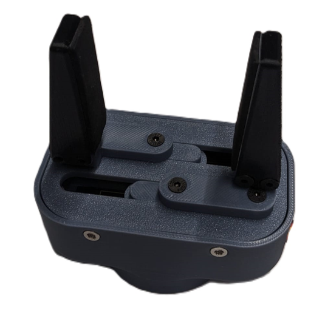

# diy_robotics

## Overview

This repo contains the results of a project work at the University of Applied Sciences Karlsruhe by **Robin Wolf, Hannes Bornemann and Mathias Fuhrer**. As part of the project work, the [Six-Axis Robot Arm WE-R2.4 from LoboCNC](https://www.printables.com/de/model/132260-we-r24-six-axis-robot-arm) was set up and a new gripper was developed.

The CAD files of the gripper and assembly instructions can be found in folder [diy_robotics_gripper_cad](https://github.com/mathias31415/diy_robotics/tree/main/diy_robotics_gripper_cad).

Two PCBs were designed for the electrical wiring: one PCB for the 6 axes and one PCB for the gripper. The KiCAD and Gerber files can be found in the folders [diy_robotics_arm_pcb](https://github.com/mathias31415/diy_robotics/tree/main/diy_robotics_arm_pcb) and [diy_robotics_gripper_pcb](https://github.com/mathias31415/diy_robotics/tree/main/diy_robotics_gripper_pcb).

To control the 6 axes and the gripper, ROS2 implementations were written that communicate via Wifi with an ESP32, from which the axes and the gripper are then moved. One ESP32 is responsible for the 6 axes, and the second ESP32 is responsible for the gripper.

The ROS2 packages are packaged in Docker containers so that they can be used by others without any problems. The repos of our ROS2 packages are linked in the folder [ROS-Packages](https://github.com/mathias31415/diy_robotics/tree/main/ROS-Packages). To just use our ROS application go to the repo [diy_robot_application](https://github.com/RobinWolf/diy_robot_application) and follow the HowTo. To understand our implementation you should read all readmes of our ROS repos 

The PC on which the ROS2 packages are executed must be connected to the same Wifi as the two ESP32s. The two ESP32s then receive messages from the PC via TCP-IP with the commands for the gripper and the 6-axes and then control the gripper and the axes accordingly. The VS-Code PlatformIO project folders for the ESP32 of the gripper and the axes can be found in the folders [diy_robotics_arm_esp32](https://github.com/mathias31415/diy_robotics/tree/main/diy_robotics_arm_esp32) and [diy_robotics_gripper_esp32](https://github.com/mathias31415/diy_robotics/tree/main/diy_robotics_gripper_esp32). Make sure to adapt the SSID and IP address as well as the password of your Wifi in the ``Configuration.h`` file.

The [hardwaretest_without_ROS](https://github.com/mathias31415/diy_robotics/tree/main/hardwaretest_without_ROS) folder contains additional programs to test the hardware without ROS via the Serial Monitor.

## Possible improvements

- Conversion of the robot to metric screws
- Endstops or sensors to determine the position of the robot or to move it to a home position

