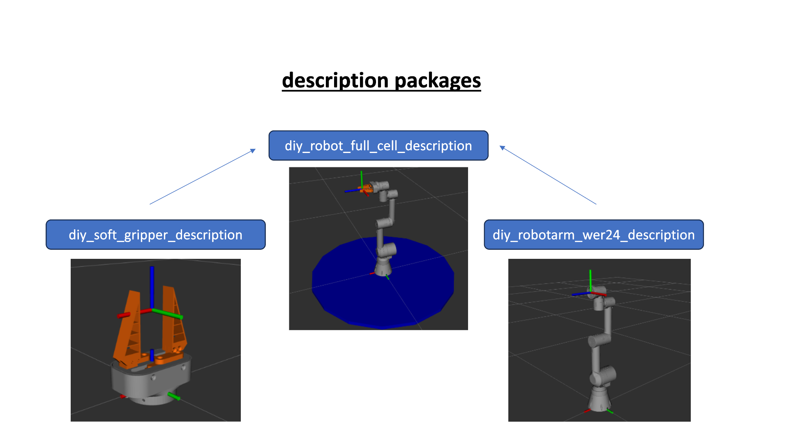
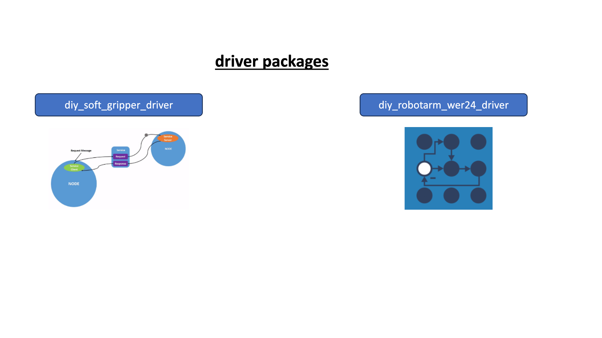
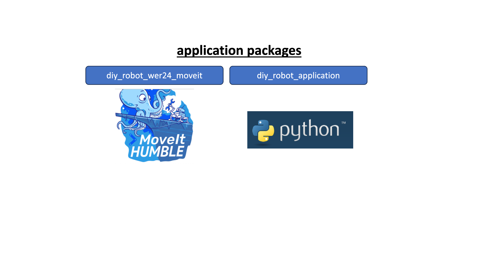
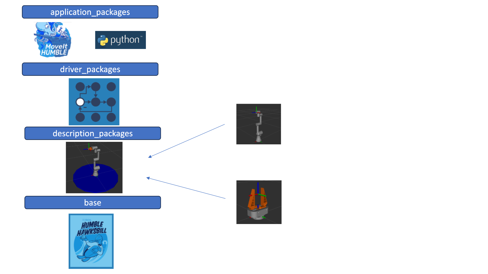

# Main Readme for the ROS-Integration of our DIY-Robotarm and Gripper

This Readme file works as an overview about the complete ROS-integration of our robot and gripper. It should clarify our way to set up the whole ROS project before you take a deeper inlook into the single package Readme's.
ROS (Robot Operating System) is a open-source software framework for robotics tasks. In the following we will use the ROS2 distribution Humble. 

Every mentioned package has its own readme where deeper informations about the structure, development process and content are provided.

## Main Ideas/ Tasks
- ROS runs on a LINUX- device and sends control messages to the ESP32 microcontroller on the hardware side. No complex calculations on the ESP32 are needed.
- Ensure that developed ROS-Packages are reusable for other projects -> Modularity is recommendet
- Use docker in development and deployment, so no version and dependencie issues should occur when ROS is running on other computers.
- The 6 axis robotic arm shold be controlled within the ROS2-Control framework, for the gripper only a bool state control (opening and closing) shold be implemented.
- Set up Moveit 2 for motion planning
- Implement the python user interface as known from the other robotic-systems in the IRAS laboratory.

## Structure
As mentioned above modularity is one of our main targets while software-development. Using docker in development and deployment of the packages facilitates to deal with that requirement.
Every ROS robotics project has three key parts.

**Part 1 is the description of the robotics hardware.** The description package contains all things to represent the hardware inside the ROS-framework such as the URDF-Model.
Our full diy robotics "cell" consists of the 6-axis arm, the gripper and the subframe where the arm is mounted on. So in total wee need 3 seperate packages to describe our diy robot inside the ROS-framework as shown below:



**Part 2 are the drivers.** The drivers link the description (digital robot) to the real hardware. For the arm and the gripper we use different control stategies.
Due to the complexity of controlling 6 dependent axis, the arm is fully included in the ROS2-Control framework. The control message to the ESP32 contains the next axis setpoints (next interpolated point in th C-Space when creating trajectories), some status bits and some bits for communication management. Because we kept the hardware as sinple (and cheap) as possible, no sensors for joint-states are included. We operate the arm in an Open-Loop control. If the arm is used inside the specified physical limits, this should not be a disadvantage. For more informations on this point, please switch to the overall-Readme.
Because of simplicity the gripper doesn't need to be integrated in ROS2-Control. The gripper driver package only contains a simple service-definition wich sends a bool (0 or 1) to the robot where 0 equals open and 1 close.
So in total we need 2 seperate driver packages:



**Part 3 of our robotics system integration is the application.** Firstly these packages contain Moveit configurations to enable motion planning to provide trajectories for the robot. Secondly a user-friendly interface for programming the robot is integrated here. At the end the upcoming users should be able to develop robotic applications with our diy hardware by just writing a simple python code where trajectories and motions (PTP, LIN) could be programmed.



To build our robotics control system from the introduced packages, we need to connect them.
There are multiple possible ways to connect the provided packages/ the docker containers. We have choosen a "stacked" technique. When launching the whole system with all packages included, this container was built in different stages. Every stage inside the Dockerfile defines a image which represents one step of the build process. In every stage one of the depencencie packages and needed ROS extentions get installed/added to the container. The next stage uses this stage as their base image and puts another package on top. 
In our implementation all stages of the image were build everytime you want to run the container, for further deployment it's also possible to upload the final built image in dockerhub or other cloud platforms and just call this instead of rebuilding at every call. The following chart should display the concept and how we build our whole ROS-Framework from the introduced packages:



So in total we need to develop 3 description packages, 2 driver packages and 2 application packages.

## Development
Every mentioned package was developed more or less independend. For simple development and deployment, every package has its own GIT repository.
In the development phase of the packages we connect a source folder from our host-machine to the docker container. This setup enables coding on the host-machine and testing the packages in a docker container at the same time. All changes in this setup are pushed on the dev branch of the desired repo. 
pleas refer to the Readme's in the desired package repos for deeper informations about the structure, development process and content of the introduced packages.

## Deployment
After development was finished we reorganized the structure inside the package to the common ROS conventions and disconnected the source folder from our docker container. This was pushed to the main branch of the desired repo. For further deployment the repo which contains all the code gets directly cloned in the docker container while building the container from the provided image.

If you want to run the package on your PC in the deployed docker container, you should follow the given guideline:
1) Clone the Repo which contains the package you want to run to your LINUX-PC. (hint: working docker installation required)
2) Open a new terminal and navigate to the cloned content
3) build the docker container from the provided image by sourcing the run script. ```./run.sh```

Now you are inside the container and the package should run -> building, sourcing and launching the ROS package was done automatically
