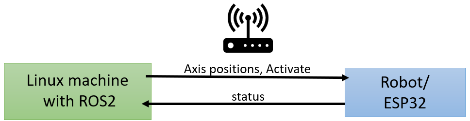

# diy_robotics_arm_esp32
This code initializes a robotic system with multiple axes, each controlled by a stepper motor. It uses an ESP32 microcontroller, a display (SSD1306), and communicates with a PC over WiFi. The data format for communication between ROS and the ESP32 is defined in ``DataFormat.hpp``. The target axis positions of the 6 axes and an activate signal are transmitted. The activate signal is an indicator that ROS and the ESP are connected. 
The code defines the axes, sets up communication using the ``WiFiConnection.hpp``, and handles data reception from the PC. The robotic system is activated or deactivated based on commands from the PC. The code continuously checks for updates from the PC, adjusts axis positions accordingly, and updates the display with relevant information. If the axles do not need to be moved, the axles are switched off so that the motors do not get warm. In addition, the hardware enable switch is monitored with which the axes can also be switched off. If the axes are deactivated with this switch, the axis movement is also stopped on the software side.

