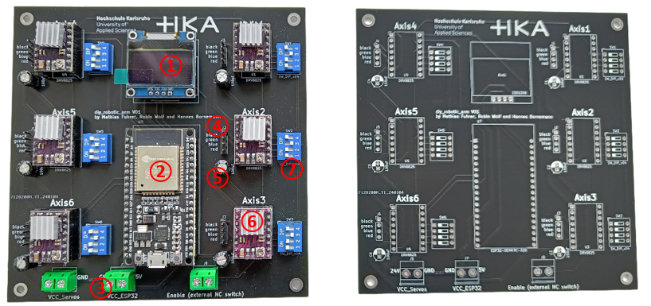

# diy_robotics_arm_pcb

### ① 0.96 Inch OLED Display SSD1306 (1 pcs.) 
### ② ESP-32 (1 pcs.)
### ③ 2-Pin Screw Terminal 5mm (3 pcs.)
### ④ Pin Header 1x4 Pin Male 2,54mm (6 pcs.)
### ⑤ Capacitor 25V 100uF (6 pcs.)
### ⑥ DRV8825 Stepper Driver (6 pcs.)
### ⑦ 4-way DIP-Switch 2,54mm (6 pcs.)

(①, ② and  ⑥ are plugged into female pin header 2,54mm)

5V for the ESP32 power supply must be connected to the "VCC_ESP32" screw terminal. 24V for the servo stepper power supply must be connected to the "VCC_Stepper" (on the picture incorrectly "VCC_Servo") screw terminal. The steppers of axes 1 - 6 are connected to the pin header "Axis 1-6". An external enable switch can be connected to the "Enable" screw terminal. This allows the axes to be switched off independently of the software. If no switch is to be used, the contacts can be short-circuited.

