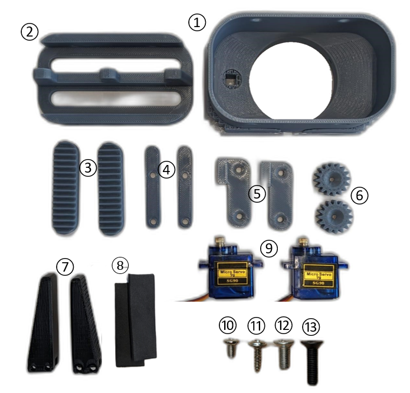
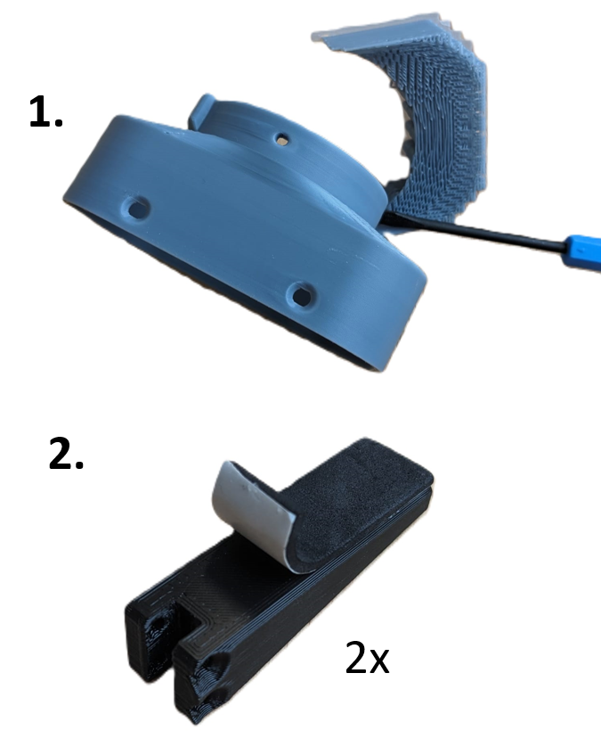
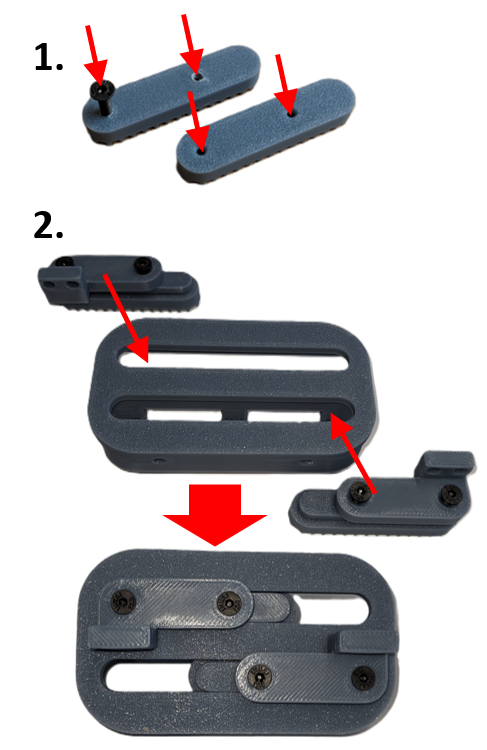
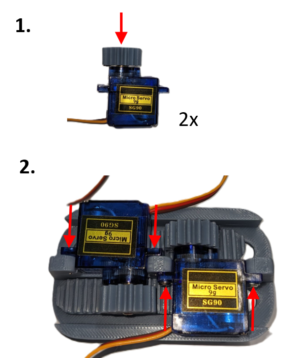
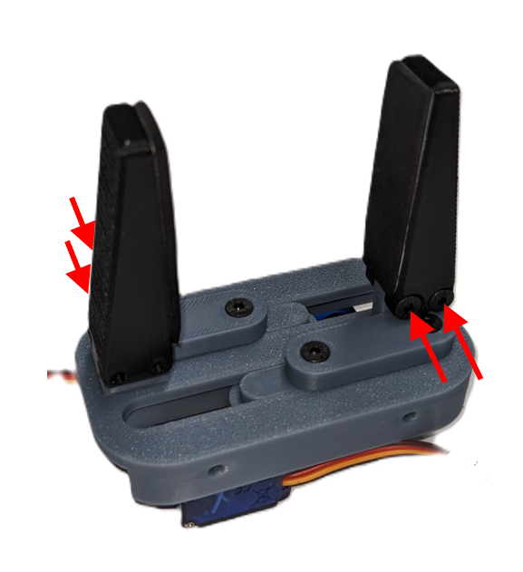
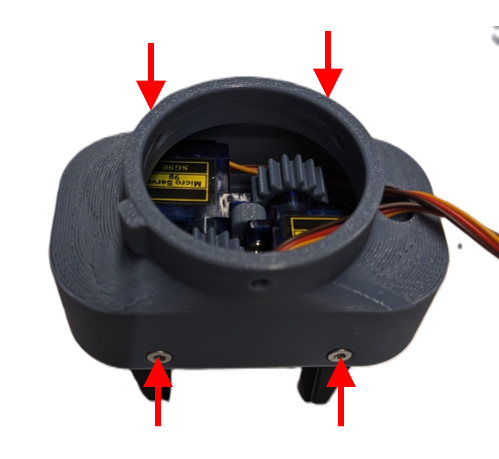
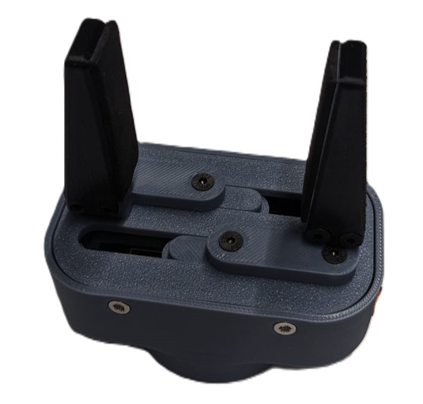

### 1. get parts

① "mounting_adapter" (1 pcs.)

② "laufschiene" (1 pcs.)

③ "rack" (2 pcs.)

④ "rack_spacer" (2 pcs.)

⑤ "gegenstueck_rack" (2 pcs.)

⑥ "gear_16_teeth" (2 pcs.)

⑦ "finger_50mm" (2 pcs.)

⑧ Foam rubber strips (2 pcs.)

⑨ Servo-Motors SG90 continuous drive (2 pcs.)

⑩  Servo screw for drive socket (2 pcs.)

⑪ Servo fastening screw (2 pcs.)

⑫ Countersunk head screw M3x8 (4 pcs.)

⑬ Screw countersunk head M3x12 (8 pcs.)

### 2. prepare parts

### 3. install servo mounts

(The parts must first be inserted into the housing and then screwed together. The parts cannot be installed in the housing when they are screwed together.)

### 4. mount servos

### 5. mount gripper jaws

### 6. mount housing

