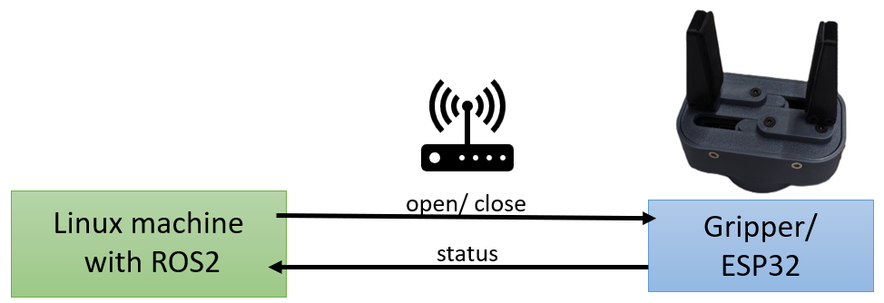

# diy_robotics_gripper_esp32
This code initializes a system with a gripper controlled by an ESP32 microcontroller. It includes a display (SSD1306) for visual feedback and communicates with a PC over WiFi. The data format for communication between ROS and the ESP32 is defined in ``DataFormat.hpp``. The gripper's state is manipulated based on commands received from the PC, and the system responds with the updated gripper state. The code also handles network connections and displays relevant information on the screen. The main loop is empty as most of the tasks are performed in a separate task named "networkTask."

