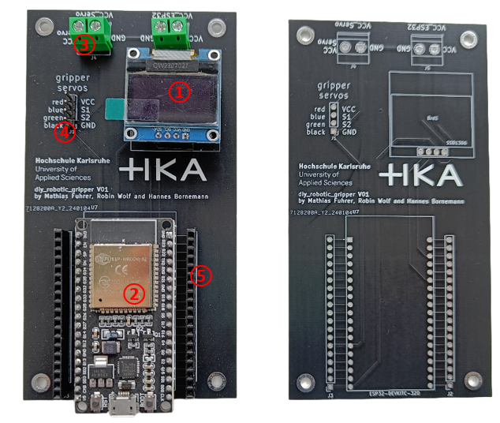

# diy_robotics_gripper_pcb

① 0.96 Inch OLED Display SSD1306 (1 pcs.) 

② ESP-32 (1 pcs.)

③ 2-Pin Screw Terminal 5mm (2 pcs.)

④ Pin Header 1x4 Male 2,54mm (1 pcs.)

⑤ Pin Header Female 2,54mm

(① and ② are plugged into female pin header 2,54mm)

5V for the ESP32 power supply must be connected to the "VCC_ESP32" screw terminal. The power supply for the servo must be connected to the "VCC_Servo" screw terminal (6V). The servos are connected to the pin header "gripper servos".
