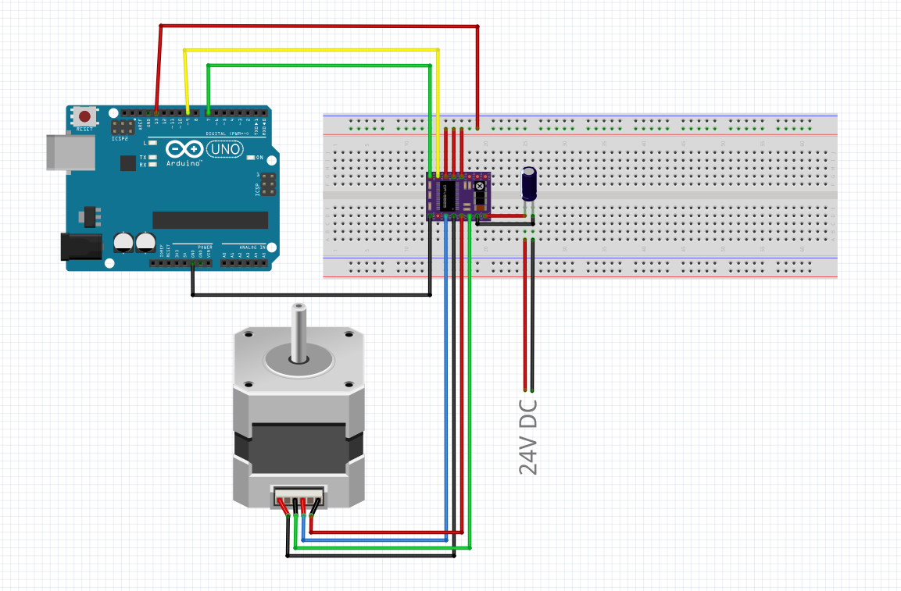

# hardwaretest_without_ROS

The PlatformIO projects [Gripper_via_SerialMonitor](https://github.com/mathias31415/diy_robotics/tree/main/hardwaretest_without_ROS/Gripper_via_SerialMonitor) and [SixAxis_via_SerialMonitor](https://github.com/mathias31415/diy_robotics/tree/main/hardwaretest_without_ROS/SixAxis_via_SerialMonitor) work with the PCB provided in this repo. The gripper can be opened and closed by entering 0 and 1 in the Serial Monitor. The axes can be moved in both directions using the buttons that can be found in the program code. However, the axes must first be enabled with "n" (disable with "m").

For the PlattformIO project [StepperTest_ArduinoUno](https://github.com/mathias31415/diy_robotics/tree/main/hardwaretest_without_ROS/StepperTest_ArduinoUno), the stepper and the ArduinoUno must be connected as follows:

The stepper can be moved via the serial monitor using the "f" and "r" keys. This is helpful when assembling the robot.